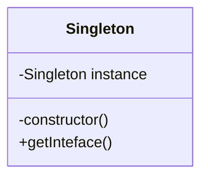

### 单例模式

确保类只有一个实例，而且自行实例化并向整个系统提供这个实例。

#### UML图



#### 实现

##### 懒汉式

在类加载时不进行实例化，仅在初次使用时进行实例化。

```typescript
class Singleton {
  private static singleton: Singleton;
 
  private container () {}
  
  public getInterface(): Singleton {
    if (!Singleton.singleton) {
      // 初次使用时进行实例化
      Singleton.singleton = new Singleton;
    }
    return Singleton.singleton;
  }
}
```


##### 饿汉式

在类加载时就进行实例化。

```typescript
class Singleton {
  // 实例化
  private static singleton = new Singleton();
  
  private constructor() {}
  
  public static getInstance(): Singleton {
    return Singleton.singleton;
  }
}
```

